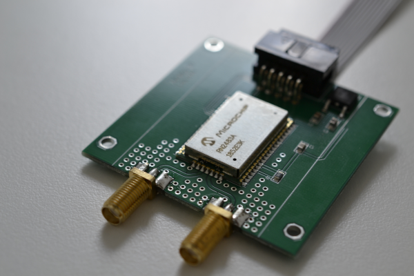
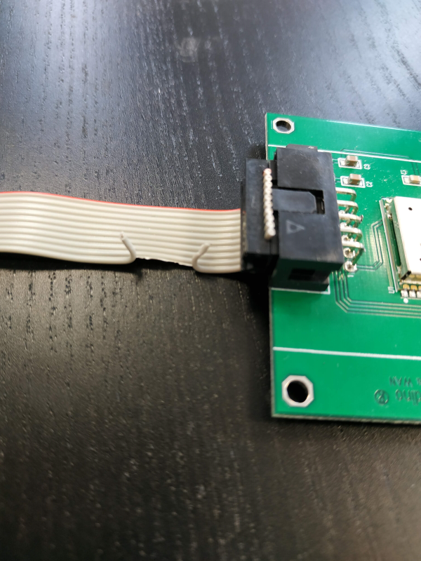
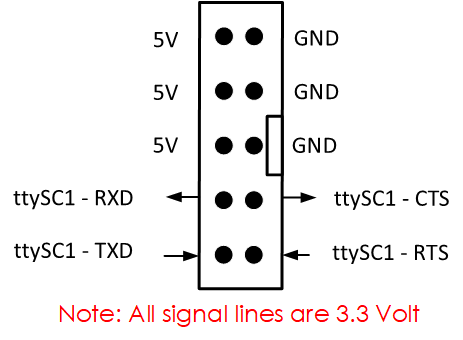

LoRaWAN Modem (RN2483) Setup & Documentation 
======

The Lora Modem is connected via the internal RS232 Connector to the /dev/ttySC1.

### Preparing Debian
First, run

    sudo nano /boot/cmdline.txt

To ensure correct shell behavior, remove entries beginning with *console=* in this file. An example for entries needing to be removed is highlighted here with *>>[entry]<<*. After having edited the file, save and exit.

    dwc_otg.lpm_enable=0   >>console=serial0,115200 console=tty1<<   root=/dev/mmcblk0

Afterwards, run

    sudo nano /boot/config.txt

Jump to the end of the file and add

    enable_uart=1
    dtoverlay=pi3-disable-bt-overlay
    dtoverlay=pi3-miniuart-bt

Finish by rebooting the pi
    
    sudo reboot
    
### Configuring the modem

First, install some tools for testing
    
    sudo apt-get install screen elinks minicom

Testing the modem connection can be done via minicom. For the initial setup, run
    
    sudo minicom --setup

After having completed the initial setup, minicom can be run without the --setup flag in the future. Enter Serial port setup

	+-----[configuration]------+
    | Filenames and paths      |
    | File transfer protocols  |
    | Serial port setup        |
    | Modem and dialing        |
    | Screen and keyboard      |
    | Save setup as dfl        |
    | Save setup as..          |
    | Exit                     |
    | Exit from Minicom        |
    +--------------------------+

Here the connection can be set up. To connect to the modem, the serial device has to be set to */dev/ttySC1*.

    +-----------------------------------------+
    | A -Serial Device  : /dev/ttySC1         |
    | B - Lockfile Location : /var/lock       |
    | C -   Callin Program  :                 |
    | D -  Callout Program  :                 |
    | E -Bps/Par/Bits   : 57600 8N1           |
    | F - Hardware Flow Control : No          |
    | G - Software Flow Control : No          |
    |                                         |
    |Change which setting?                    |
    +-----------------------------------------+

After completing the configuration, press the Esc key to return to the main setup menu, choose *Save setup as dfl* to save the configuration for future usage and exit.

### Hardware remarks

The Reset of the Modem can be controlled via the RTS Line. By default this line is cut the that the Modem runs on Power On. If you like to controll the Reset via RTS you need to replace the cable.

 

### Example 

    pi@raspberrypi:~ $ python get-deveui.py
    sys reset
    RN2483 1.0.4 Oct 12 2017 14:59:25
    mac get deveui
    0004A30B002544A2
    
