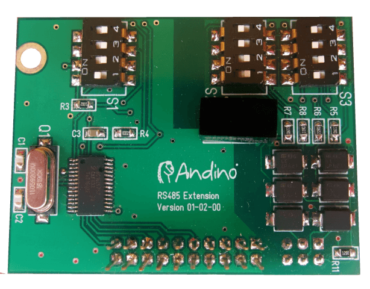
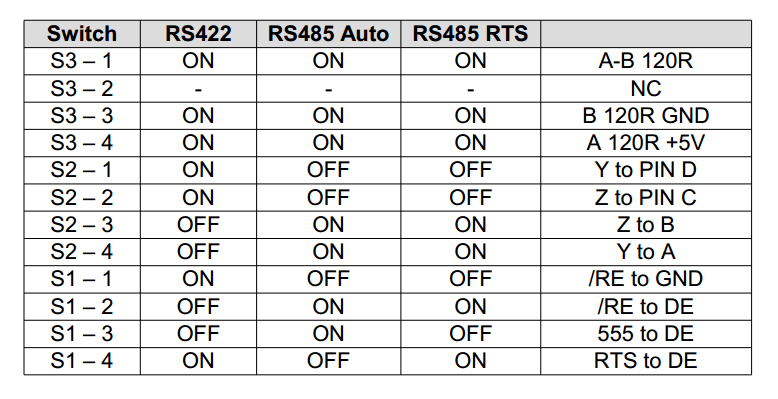

Fully isolated RS485 and RS422 Extension: Setup
======

This Plugin for the [Andino X1][1], provides a single channel, fully Isolated RS485 extension for the Raspberry Pi or the Arduino Controller. This PlugIn can be jumpered as a two wire, half duplex or as a four wire full duplex interface. This Board based on the SPI Uart from NXP [SC16IS752][3]. The SPI Channel can be jumpered to the Raspberry Pi or the Arduino Controller. With the Arduino Controller time critical protocols can be implemented or a general pre processing of the data can be performed.

### Contents
This Repository contains (see at the top of the page for downloads)
 
* Schematics
* Overlay for the Raspberry Pi
* Library for the Arduino

### Overview
In Half Duplex Mode the transmitter can be switched on by the application with the RTS signal or automatically by the Hardware (Auto Transmitter on). 

The lines are connected to the A-D connectors. The E connector provides a 100 Ohm ground.

The connector screw terminal as found on the Andino X1:

#### Jumper Overview

### Installation on the Raspberry Pi 

#### Installing sc16is752

First, download the sc16is752 overlay dts-file and the makedts script:

	wget https://github.com/andino-systems/Andino/tree/master/Andino-Common/Extensions/RS232/Raspberry/sc16is752-spi0.dts
	wget https://github.com/andino-systems/Andino/tree/master/Andino-Common/Extensions/RS232/Raspberry/makedts.sh

Make the script executable and run it

	chmod +x makedts.sh
	./makedts

Alternatively, sc16is752 can also be installed from the dtbo file:

	wget https://github.com/andino-systems/Andino/tree/master/Andino-Common/Extensions/RS232/Raspberry/sc16is752-spi0.dtbo
	sudo cp ./sc16is752-spi0.dtbo /boot/overlays/

#### Starting sc16is752 on bootup 

To start sc16is752 on bootup, append this to the */boot/config.txt* file. Run

	sudo nano /boot/config.txt

And add the following lines to the end of the file:

	dtparam=spi=on
	dtoverlay=spi0-cs,cs0_pin=8,cs1_pin=12
	dtoverlay=sc16is752-spi0,int_pin=7

Save the file and quit, then reboot. After that two new Devices are available: */dev/ttySC0* and */dev/ttySC1*

### Testing the devices

To test device functionality, first install minicom:

	sudo apt-get install minicom

For the initial setup, run
    
    sudo minicom --setup

Enter Serial port setup

	+-----[configuration]------+
    | Filenames and paths      |
    | File transfer protocols  |
    | Serial port setup        |
    | Modem and dialing        |
    | Screen and keyboard      |
    | Save setup as dfl        |
    | Save setup as..          |
    | Exit                     |
    | Exit from Minicom        |
    +--------------------------+

Here the modem connection can be set up. Set the serial device to either */dev/ttySC0* or */dev/ttySC1*, depending on which device you want to test.

    +-----------------------------------+
    | A -Serial Device  : /dev/ttySC0   |
    | B - Lockfile Location : /var/lock |
    | C -   Callin Program  :           |
    | D -  Callout Program  :           |
    | E -Bps/Par/Bits   : 115200 8N1    |
    | F - Hardware Flow Control : No    |
    | G - Software Flow Control : No    |
    |                                   |
    |Change which setting?              |
    +-----------------------------------+

After completing the configuration, press the Esc key to return to the main setup menu and exit. The configured device should now show up normally in minicom. 

### Application examples
* Meter Reading (e.g. IEC 1107)
* Serial data Collect

### Troubleshooting and external links
[Forum SC16IS752 (SC16IS7XX driver) Device Tree problem][4]  
[Device Tree, Overlays and Parameters][5]  
[List of Overlays][5]  

Author
-----

* 2020 by AndinoSystems
* [Contact us by email](mailto:info@andino.systems)

[1]:https://andino.systems/andino-x1/
[3]:http://www.nxp.com/docs/en/data-sheet/SC16IS752_SC16IS762.pdf?
[4]:https://www.raspberrypi.org/forums/viewtopic.php?t=146908&p=1083915#p1024636
[5]:https://www.raspberrypi.org/documentation/configuration/device-tree.md
[6]:https://github.com/raspberrypi/firmware/tree/master/boot/overlays
