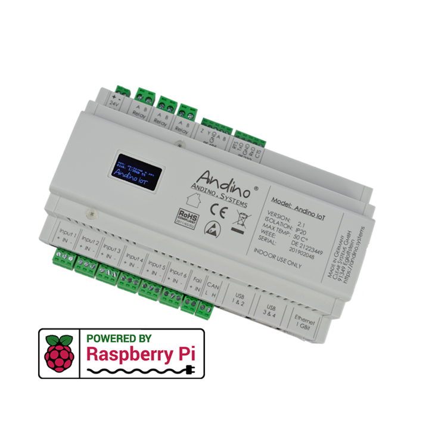
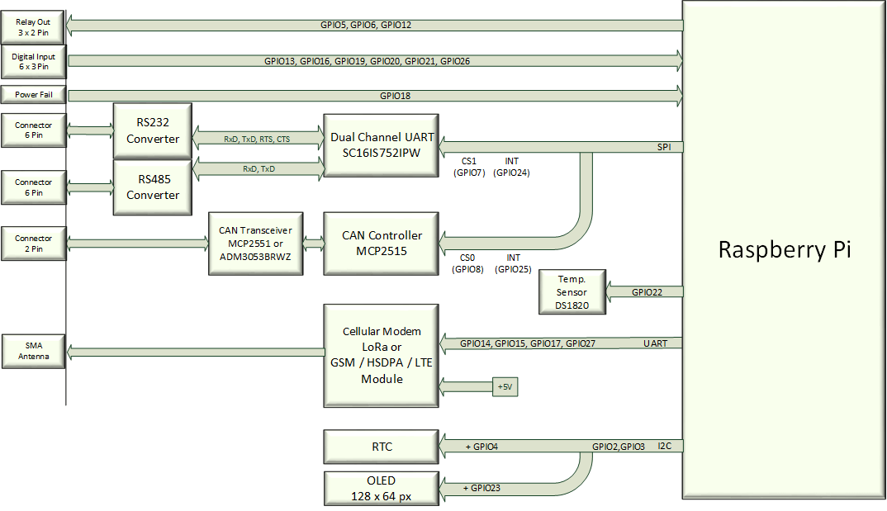

Andino IO
==========

**This page provides a general introduction on the Andino IO without any extensions. For documentation and setup tutorials about a specific product that includes extensions, please choose an entry from this list:**

- [Andino IO with Raspberry Pi, LoRaWAN, Heatsink and RTC](./Products/Andino-IO_LoraWAN-Modem)
- [Andino IO with Raspberry Pi, 2G Modem, Heatsink and RTC](./Products/Andino-IO_2G-Modem)
- [Andino IO with Raspberry Pi, 4G/LTE Modem, Heatsink and RTC](./Products/Andino-IO_4G-Modem)

**For more technical documentation on the base board, including setup tutorials and download links for drivers and firmware, please refer to [Andino IO: BaseBoard Setup](./BaseBoard)**

  

The [Andino IO][1], like its little brother Andino X1, is a motherboard for the Raspberry Pi. It allows mounting on a DIN rail in the control cabinet.

## Overview

The [Andino IO][1] is a microcontroller board for the Raspberry Pi in a DIN-rail housing for installation in a control cabinet. It is used to adapt digital inputs and outputs for a voltage of 24 V. It also contains a Raspberry Pi. The inputs and outputs as well as the power supply of the Pi are optimally protected. Communication between the microcontroller and the Pi takes place via the UART interface.

The [Andino IO][1] offers the following advantages:

The sensitive GPIO of the Raspberry Pi are protected. Fast signals can be precisely detected by the microcontroller. Actuators and sensors can be electrically connected to the Raspberry Pi. It provides an industrial power supply for the Raspberry Pi. Customized adapters from the Raspberry Pi GPIO or the micro controller IO can be connected electrically to terminals. Provides mounting on a DIN rail for installation in manifolds.

#### Raspberry Pi compatible 
The 40-pin connector is compatible with Raspberry Pi 3 B and Raspberry Pi 4

#### Integrated power supply 
The IO board has a 9-30V wide-range DC input with reverse polarity protection. The integrated EMC protection circuits protect the Pi from voltage surges and current surges on the supply line.

#### 6 galvanically isolated inputs 
The IO board has six electrically isolated inputs (up to 5kV isolated) as well as three relay outputs for 240 volts and 3 amps.

#### Realtime Clock (RTC)
The integrated, battery-buffered RTC provides the correct time even if no NTP (time) server is available. The high-precision time chip DS3231 from Dallas Semiconductors is used. Due to the internal temperature compensation of the oscillator, the chip achieves a very high accuracy of ± 2ppm at 0 ° C to + 40 ° C.

#### OLED Display
A 0.96 inch, 128 x 64 pixel I2C OLED display enables easy monitoring of data from the IO.

## Block diagram

### Application examples
* Production Machines
* Energy data monitoring
* Capture environmental data Interface conversions

Author
-----

* 2020 by AndinoSystems
* [Contact us by email](mailto:info@andino.systems)

[1]:https://andino.systems/andino-io/

